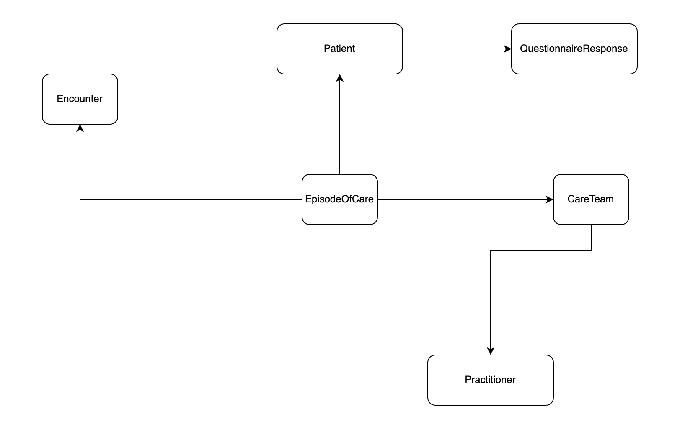

# Clinician Application

* This project was generated with [Angular CLI](https://github.com/angular/angular-cli) version 9.0.6.

### Purpose

* This application is focused on Clincians.
* The application focuses on a case, which is a patient, and handles  patient's admission, daily assessments & discharge or death. 

### Forms 

* All the forms generated in this application are based on WHO's COVID19 forms.

### Authentication

* Currently, the application receives a static token from the hapi fhir server to perform FHIR operations.
* **Note** :- The current application currently doesn't support any other authentication mechanism as that would be upto a implementor and the application didn't intend to narrow those options. 

### Dynamic Forms

* This application extensively uses [angular dynamic forms](https://angular.io/guide/dynamic-form) for form generation.

### FHIR Architecture

